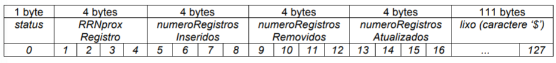
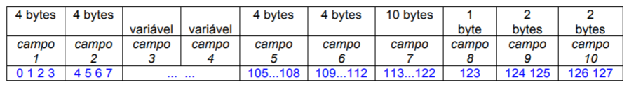
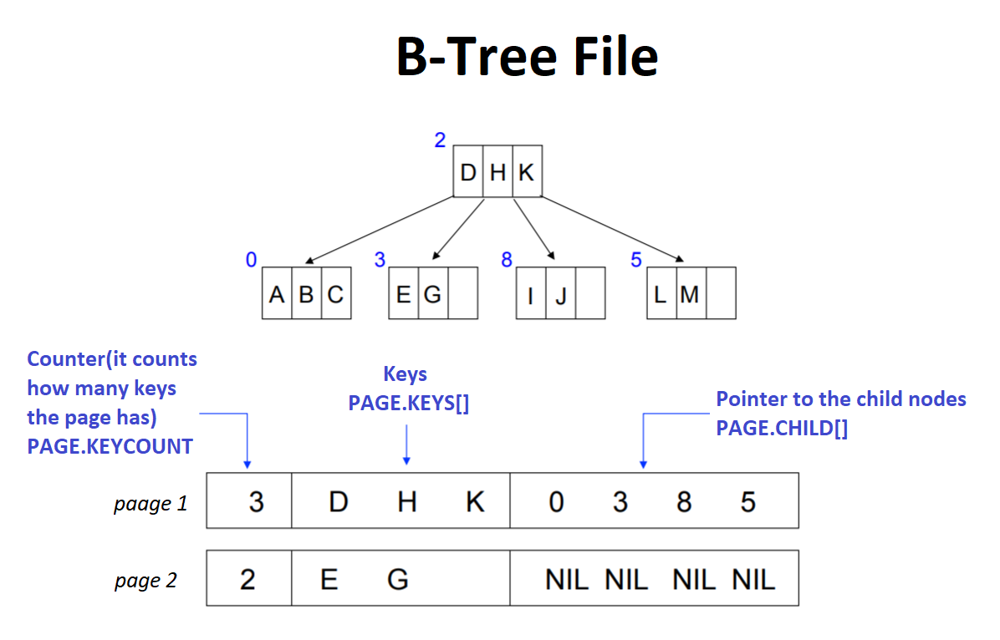
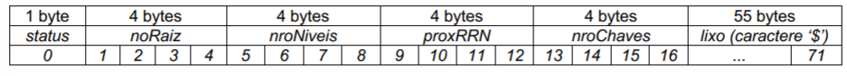
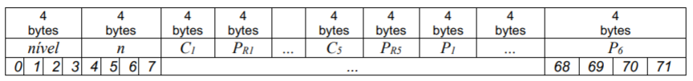

# B_Tree_T3 - Search and Insertion
### Description

Implementation of a B-Tree data scruct to indexes a binary file that contais register of births in the country

 
### Files Templates
#### Binary File
  ##### All the register in the binary file has 128 bytes, inluding the header
     The header register follows this template:
   
    
     The data register folows this template:
   
  The fields in the data register are organized followint this order:
      
campo1. sizeof the field cidadeMae (4 bytes)  
      campo2. sizeof the field cidadeBebe (4 bytes) 
      campo3. cidadeMae (variable size) 
      campo4. cidadeBebe (variable size) 
      campo5. idNascimento (4 bytes) 
      campo6. idadeMae (4 bytes) 
      campo7. dataNascimento (10 bytes) 
      campo8. sexoBebe (1 byte) 
      campo9. estadoMae (2 bytes) 
      campo10. estadoBebe (2 bytes) 

      
 #### B-Tree data structure
  ##### The B-Tree is in a binary file too and was implemented folowing this image below
  
  
        The difference in the implementation is that the page has 5 keys, and the KEY is a pair key-value, where the key
        is the birthID(field 5 of the binary data file) and the value is the current RRN of the register that contains
        this birthID
  ##### The B-Tree binary file is organized following the .github bellow:
    Header Register:
    
    
    Disk Pages:
   
